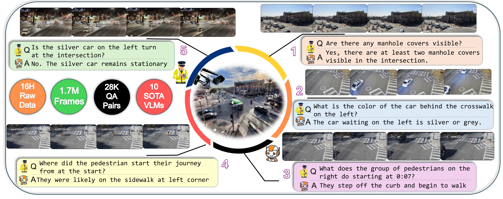
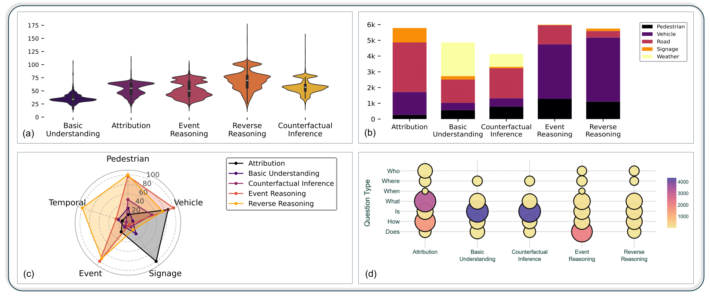
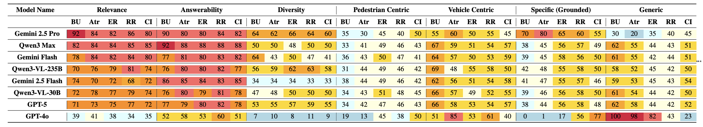

# UDVideoQA: A Traffic Video Question Answering Dataset for Multi-Object Spatio-Temporal Reasoning in Urban Dynamics


<div>
<a href="#">Paper (Coming Soon)</a> |
<a href="#">Website (Coming Soon)</a> |
<a href="#">Data (Coming Soon)</a> |
</div>
<hr>
<div style="text-align: center;">

</div>
<p align="justify">
Understanding the complex, multi-agent dynamics of urban traffic remains a fundamental challenge for video-language models (VideoLMs). <strong>UDVideoQA</strong> (Urban Dynamics VideoQA) is a large-scale benchmark designed to capture the unscripted, real-world behavior of dynamic urban scenes. Curated from <strong>16 hours (1.7M frames)</strong> of traffic footage recorded at multiple city intersections, the dataset covers diverse traffic, weather, and lighting conditions.

Unlike previous datasets, UDVideoQA employs a hierarchical taxonomy spanning <strong>five reasoning categories</strong>: Attribution, Basic Understanding, Event Reasoning, Reverse Reasoning, and Counterfactual Inference. This structure enables the systematic evaluation of both visual grounding and causal reasoning in VideoLMs.
</p>

# Related Works
<div style="text-align: center;">

</div>

## Key Features
<div style="text-align: center;">

</div>
* **Large-Scale Data:** 16 hours of raw footage, ~1.7 million frames, and **28,800 QA pairs**.
* **High Density:** Average of 3.6K QA pairs per hour (approx. one question per second of annotated video).
* **Privacy-Preserving:** Integrates a novel event-driven dynamic blurring mechanism to protect privacy without compromising scene fidelity or context.
* **Hierarchical Reasoning:** Tests models on increasing complexity, from basic perception to complex causal and counterfactual inference.
* **VideoQGen Benchmark:** Includes the first-of-its-kind benchmark for video question generation in the urban traffic domain.


# Benchmarks and Baselines

<div style="text-align: center;">

</div>

We benchmarked 10 State-of-the-Art (SOTA) VideoLMs. The results reveal a persistent "perception-reasoning gap," where models capable of abstract inference often fail at fundamental visual grounding.

**Key Findings:**
* **Proprietary Models:** **Gemini 2.5 Pro** achieved the highest overall zero-shot accuracy across varying lighting conditions.
* **Open-Source Models:** Fine-tuning the smaller **Qwen2.5-VL 7B** bridged the performance gap, achieving results comparable to proprietary systems and outperforming larger models like GPT-4o in low-light ("Evening") scenarios.
* **Challenge:** Most models struggle significantly with *Event Reasoning* and *Reverse Reasoning* compared to *Basic Understanding*, highlighting the difficulty of temporal causality.


# License

<a rel="license" href="http://creativecommons.org/licenses/by-sa/4.0/"></a><br />This work is licensed under a <a rel="license" href="http://creativecommons.org/licenses/by-sa/4.0/">Creative Commons Attribution-ShareAlike 4.0 International License</a>.

# Citation

```bibtex
@inproceedings{udvideoqa2026,
      title={UDVideoQA: A Traffic Video Question Answering Dataset for Multi-Object Spatio-Temporal Reasoning in Urban Dynamics}, 
      author={Anonymous Authors},
      booktitle={Proceedings of the IEEE/CVF Conference on Computer Vision and Pattern Recognition (CVPR)},
      year={2026},
      note={Under Review}
}
```


